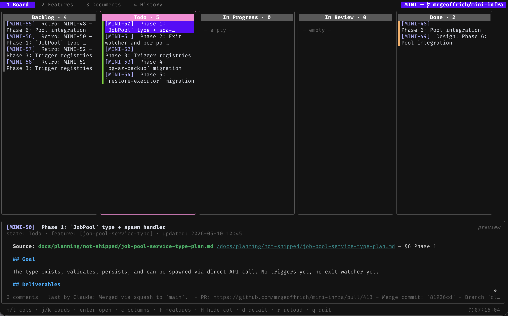
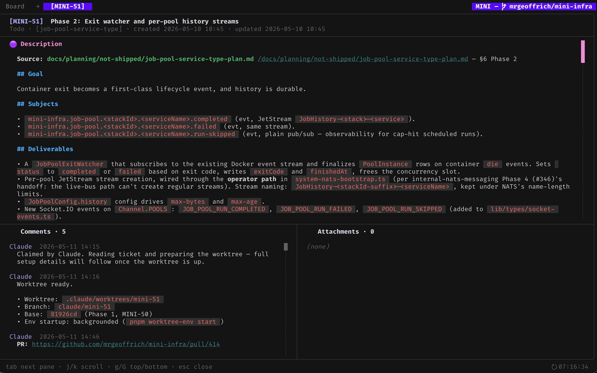
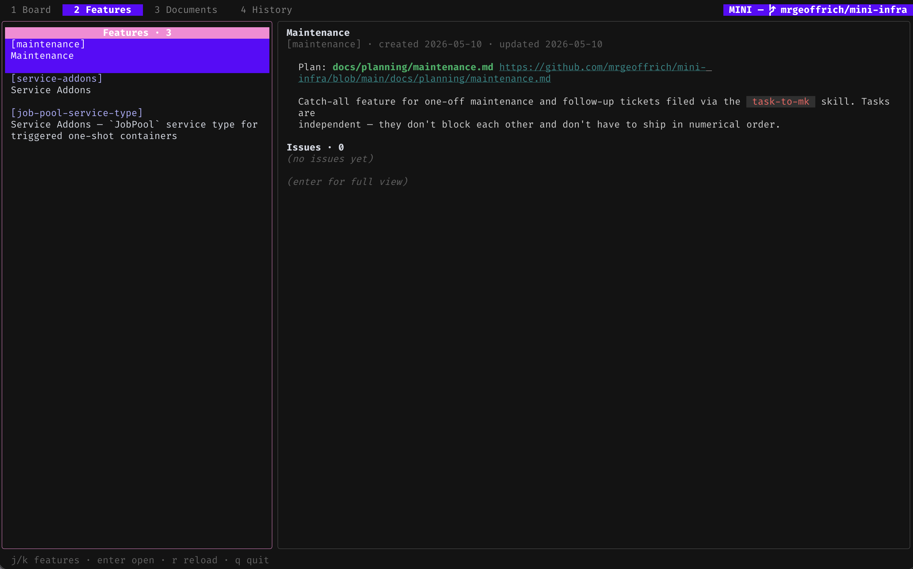
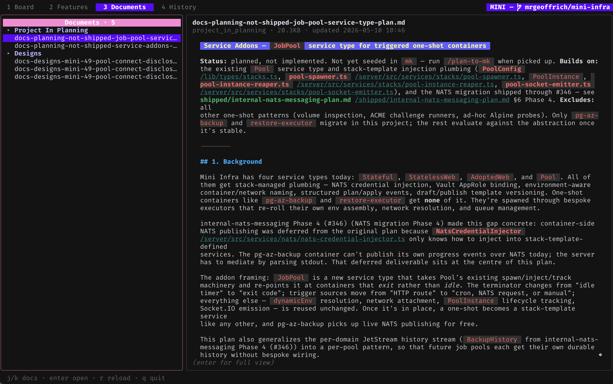
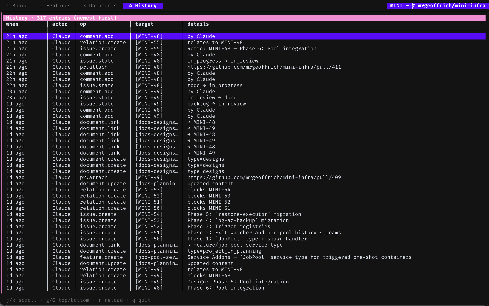

# mini-kanban (`mk`)

A local-first issue tracker designed to be **driven by an AI agent**.

You talk to Claude Code; Claude files issues, updates state, breaks features into tasks, and answers questions about your board. As a human, you mostly *read* — in your editor, on the CLI (`mk issue list`), or in the full-screen TUI (`mk tui`).

It's a single binary on top of one SQLite file at `~/.mini-kanban/db.sqlite`. No server, no account, no setup beyond `mk init` and `mk install-skill`.

## Install

**Homebrew** (macOS and Linux, prebuilt binaries):

```bash
brew tap mrgeoffrich/mk
brew install mk
```

**`go install`** (pure-Go SQLite via modernc, no CGO required):

```bash
go install github.com/mrgeoffrich/mini-kanban/cmd/mk@latest
```

**From a checkout:**

```bash
go build -o ~/.local/bin/mk ./cmd/mk
```

Either way, `mk --version` prints the version (release tag for prebuilt or `go install`-ed binaries; commit hash for `go build`).

## Quick start

```bash
cd ~/Repos/your-project
mk init                # bind this repo to a 4-letter prefix
mk install-skill       # teach Claude Code how to drive mk
```

Now open Claude Code and say:

> File an issue: the login page 500s on Safari when the password contains a `&`.

Claude does the rest.

For the full walk-through — first session, sample skills, multi-machine sync — see **[docs/getting-started.md](docs/getting-started.md)**.

## View my issues via TUI

```bash
cd ~/Repos/your-project
mk tui
```

A full-screen kanban opens with four tabs — Board, Features, Docs, History — driven entirely by the keyboard.

<p align="center">
  
</p>

Press `?` for the bindings available in the focused tab, `q` (or `ctrl+c`) to exit. Open any card for the full description and comments, or jump to the Features, Docs, and History tabs:

<p align="center">
  
  
  
  
</p>

## View my issues and features as files (sync)

`mk sync` mirrors the SQLite DB to a folder of YAML + markdown in a separate git repo — handy for browsing the board in your editor, diffing changes over time, or sharing a board across machines.

1. **Create an empty git repo for the sync data.** On GitHub:

   ```bash
   gh repo create your-project-mk-sync --private
   ```

   Any empty git remote works (GitLab, Gitea, a bare repo on a server you control); the contents are plain text.

2. **From inside your project, seed it:**

   ```bash
   mk sync init ~/sync/your-project --remote git@github.com:you/your-project-mk-sync.git
   ```

   This creates `~/sync/your-project` with one file per issue, feature, and document, commits, and pushes. It also writes `.mk/config.yaml` inside your project (check it in) so future `mk sync` calls — and other machines via `mk sync clone` — know which remote to use.

3. **Keep it in sync as you work:**

   ```bash
   mk sync                # pull → import → export → commit → push
   ```

   Run it whenever you want to flush local writes upstream and pick up anyone else's. Multi-machine setup, conflict semantics, and the inspect/verify tools live in [docs/getting-started.md](docs/getting-started.md#5-sync-across-machines-when-youre-ready).

## Why mk

- **AI-first.** Every read returns JSON, every mutation accepts a JSON payload, every payload schema is published at runtime via `mk schema`. The bundled Claude Code skill (`mk install-skill`) is the single source of truth for agents.
- **Local-first.** One SQLite file, one git working tree per project. No sync until you want it.
- **Auditable.** Every mutation records who did it, when, and what changed. Pass `--user Claude` so audits attribute correctly.
- **Optional sync.** When you want the same board on a second machine or another teammate, `mk sync init` mirrors the DB to a checked-in YAML repo over plain git.
- **Optional REST API.** `mk api` exposes the same operations over HTTP for non-shell callers (web UIs, IDE plugins, long-running agents). Same SQLite file, same JSON shapes, same audit log. See `docs/rest-api-design.md`.

## Project status

Solo-maintained, used in anger by its author. Contributions welcome — see `CLAUDE.md` for development conventions, and `docs/tui-cookbook.md` for the bubbletea/lipgloss patterns the TUI relies on.

## License

MIT — see [LICENSE](LICENSE).
